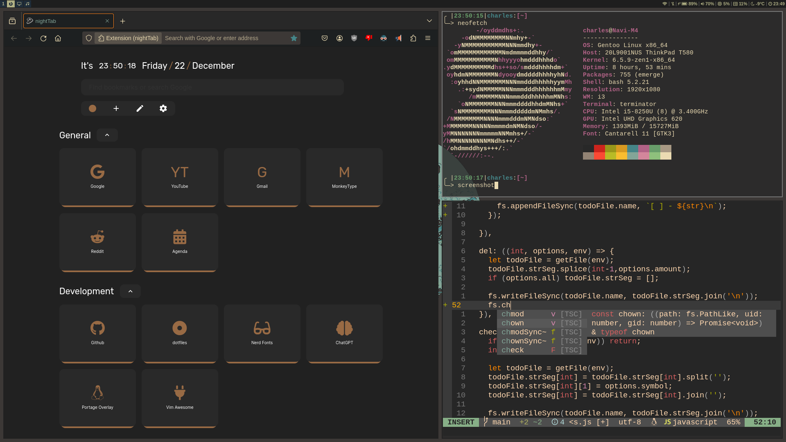

# dotfiles
Dotfiles from my gentoo/i3-gaps build

## Dependencies
- i3
- i3-blocks
- terminator
- neovim
- dmenu
- nerd fonts
- curl
- feh
- picom
- Optional:
  - spt/spotifyd
  - unclutter
  - xmodmap
  - ...
#

Made for personal use
